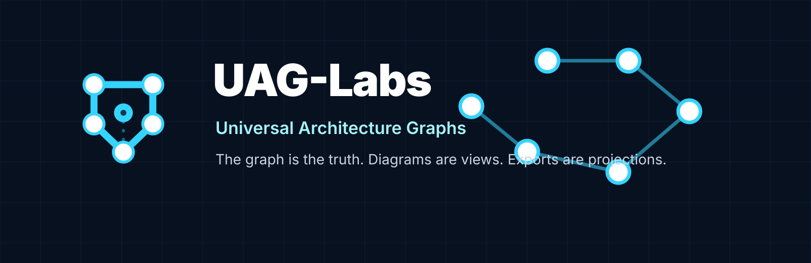

<p align="center">
  
</p>

# UAG-core

Shared Rust graph model, schemas, ontology, dialects, and validation primitives for TAKG and UAGL.

## Purpose
`UAG-core` is the canonical Rust model layer for UAG-Labs.

## Owns
- typed IDs
- TAKG structs
- UAGL structs
- graph utilities
- ontology and dialect model
- validation diagnostics
- serialization helpers
- schema versioning
- schema generation utility

## Does Not Own
- CLI commands
- full compiler pipeline
- exporters
- React/Tauri Studio implementation

## Workspace
```text
crates/uag-core
crates/uag-schema-gen
```

## First Milestone
Implement public Rust structs and serialization for the canonical object model.
